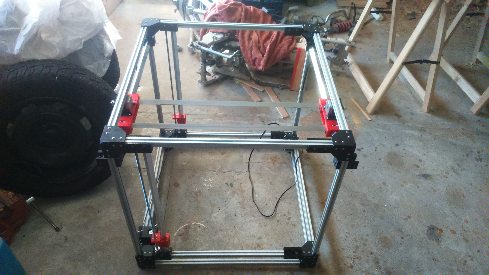

# Aryn CNC

Aryn CNC is a personal project of building a CNC machine for 3D printing, carving, or PCB drilling.
The final should result in a low cost "professional" CNC tool able to work in 50cm x 50cm x 40cm volume (X, Y, Z).

<!----->

## The goals
* **modular** : easy to add, remove and update parts => it's for me the most important goal.
* **professional** : fast, precise and strong, that's why I chose to use only high quality materials. It increase the price, but he, we want the best no ?
* **'low' cost** : far under the professional market (price estimated around 500$, expensive but not as much as a pro solution). I'm expecting same or better precision.
* **important work volume** : 50cm x 50cm x 40cm (aprox) into a 70cm side cube (you should be able to put it in your car). It's a far better ratio than most of the 3D printer (ex: [Haeckel](http://reprap.org/wiki/Haeckel) 47cm x 47cm x 57cm size for a 20cm x 20cm x 35cm print volume)
* **for makers** : if you have time, are handyman, own a 3D printer (or know someone) and like precision, this CNC is done for you.

## Before your start
* Take care to work as much precise as possible.
* Most of the parts are not available into generic DIY store, you'll need to order them online and/or contact peoples.
* You'll need a **shitload** of screws, nuts and washer : buy them into big pack (1000pcs) and keep them for future projects.
* You'll need a complete set of tools.
* Take care to have enough place (70cm side is big !).

## My Setups
Prusa i3
* 0.2mm layer height
* 30% infill, 50% for some parts which need solidity
* PLA (black, red, and maybe orange)

## Table of Content
1. [x] [Frame](./documentation/frame/frame.md)
2. [x] Axis
	* [x] [X](./documentation/x_axis/x_axis.md)
	* [x] [Y](./documentation/y_axis/y_axis.md)
	* [x] [Z](./documentation/z_axis/z_axis.md) - TODO : plate

3. [x] Tools
	* [x] Extruder
    * [Diamond Head](./documentation/tools/extruder/diamond_head/diamond_head.md) - (in experiment)
	* [x] [Milling](./documentation/tools/milling/milling.md) - (in experiment)

4. [x] Electronic
	* [x] [Power supply](./documentation/power_supply/power_supply.md)
	* [ ] Wiring - TODO
	* [ ] Program and drivers - TODO

**The project is still in progress, some parts may change and it's not my full time job (don't expect it will be finished too fast). This git is here to share my work. Fell free to test, contribute, improve or comment (create issues for that).**

If you want to support the project: 

