# BOM

| Name | Image |
| :---: | --- |
| M3 screw |  | 
| M3 washer |  | 
| M3 washer large | <a href="./m3_washer_large.png">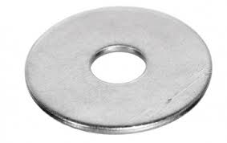</a> | 
| M3 nut |  | 
| M3 T nut |  | 
| M3 butterfly nut | <a href="./m3_butterfly_nut.jpg">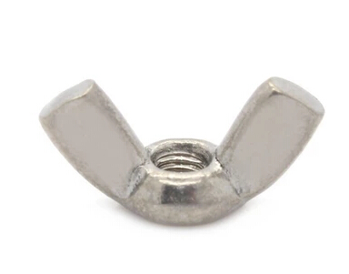</a> | 
| M3 self locking nut |  | 
| | | 
| 623ZZ bearing |  | 
| Thrust bearing 8mm |  | 
| | |
| M6 nut |  | 
| | | 
| Extruded aluminum |  | 
| Aluminum bar . 16mm x 16mm x Xmm (1.5mm thickness) | <a href="./aluminum_bar.jpg">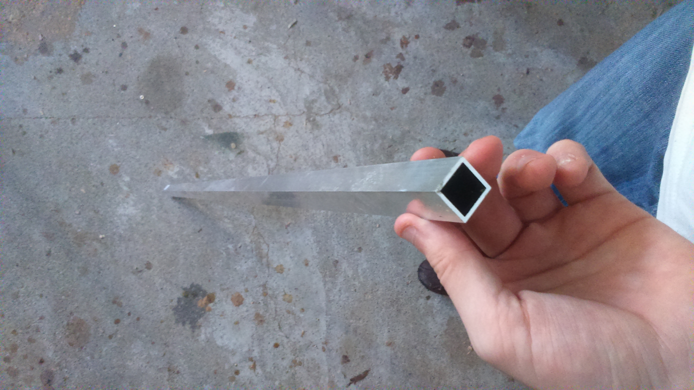</a> | 
| | | 
| Nema 17 (17HS4401) | <a href="./nema_17.jpg">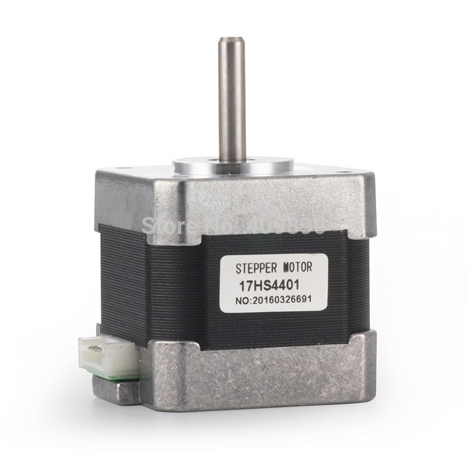</a> | 
| Nema 17 with gearbox (17HS15-1684S-PG5) | <a href="./nema_17_gearbox.jpg">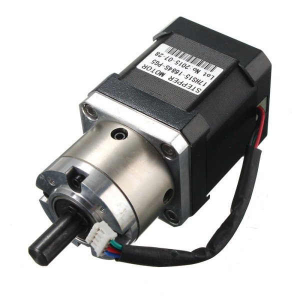</a> | 
| GT2 pulley (20 teeth 5mm bore)| <a href="./GT2_pulley_5mm.jpg">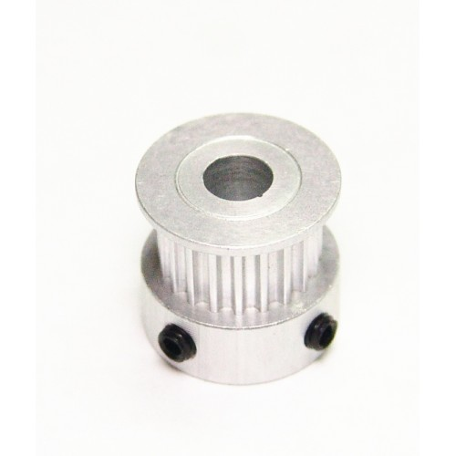</a> | 
| GT2 pulley (20 teeth 8mm bore)| <a href="./GT2_pulley_8mm.jpg">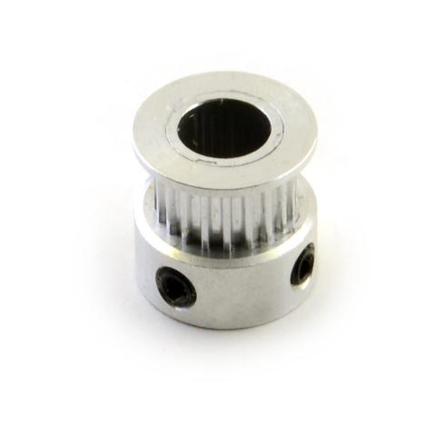</a> | 
| GT2 Belt | <a href="./gt2_belt.jpg">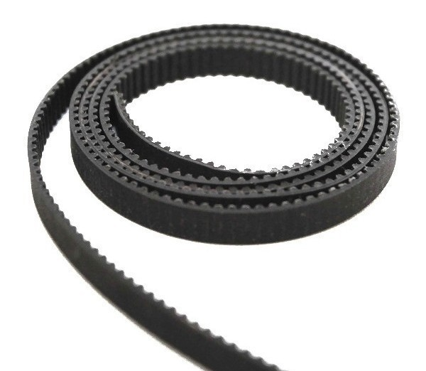</a> | 
| GT2 Belt 1524mm | <a href="./gt2_belt_1524.jpg">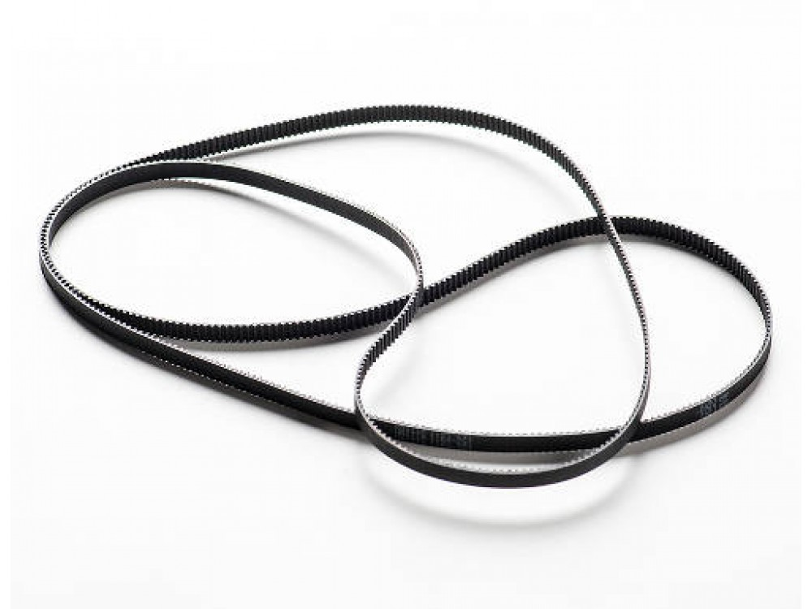</a> | 
| | |
| Threaded rod (THSL-600-8D) + Lead Nut 8mm | <a href="./lead_screw.jpg">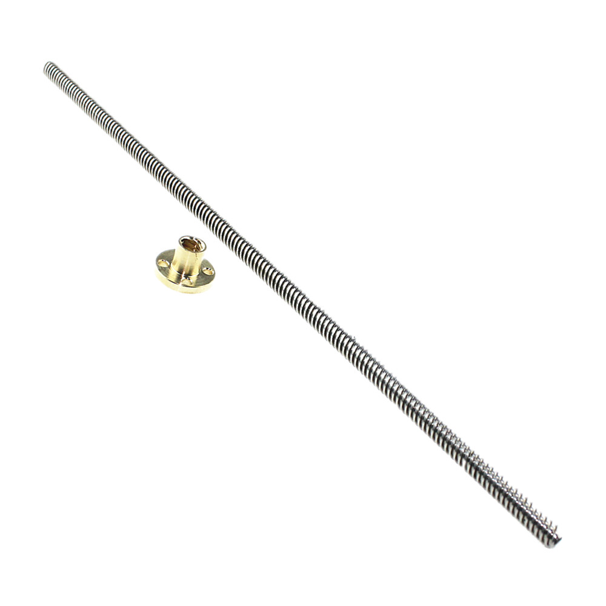</a> |
| | |
| Switch (SS-5GL) | <a href="./SS_5GL.jpg">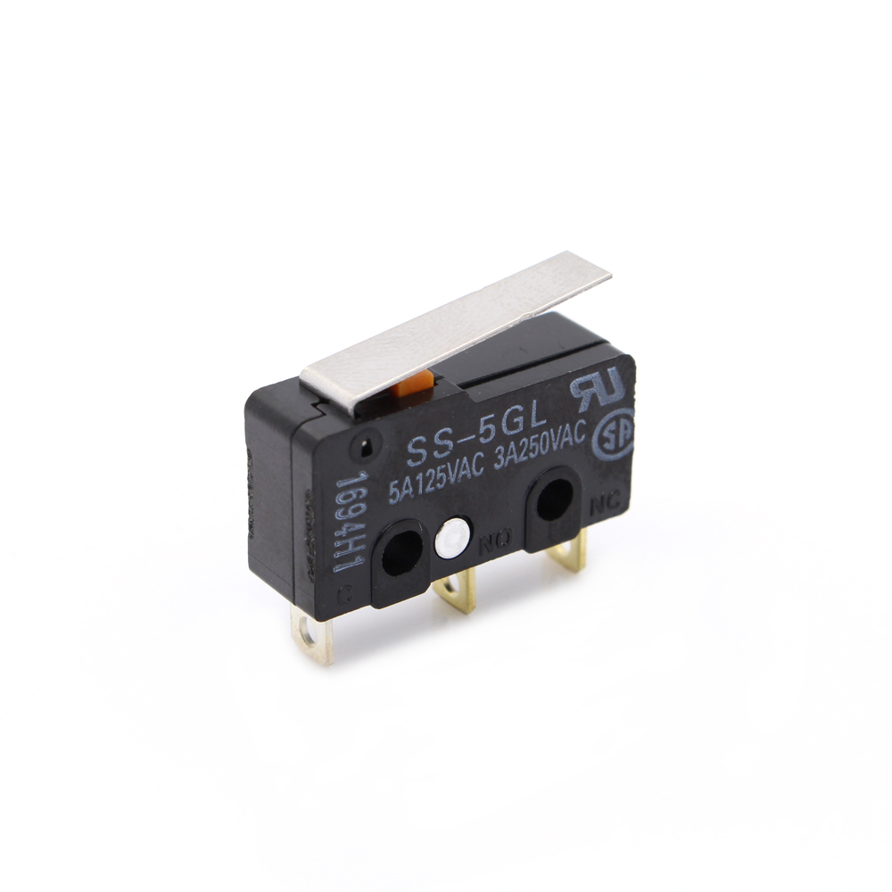</a> | 
| | |
| Male power socket IEC320  | <a href="./male_power_socket_iec320.jpg">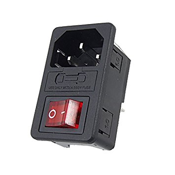</a> | 

