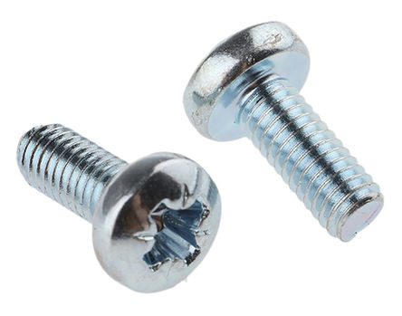
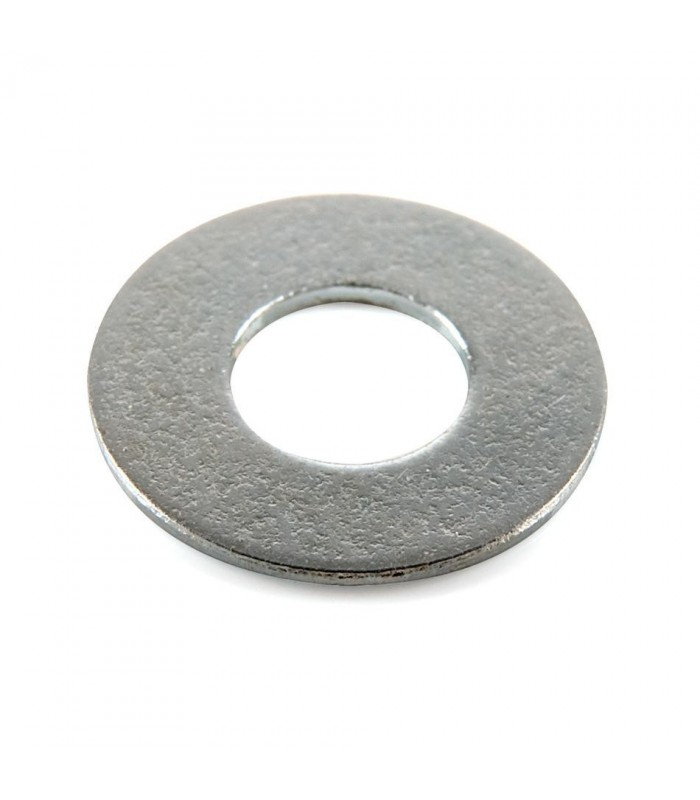
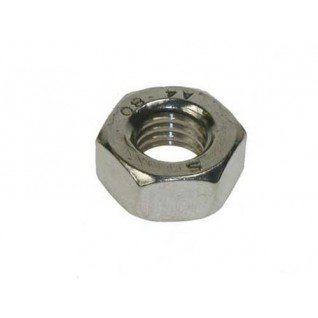
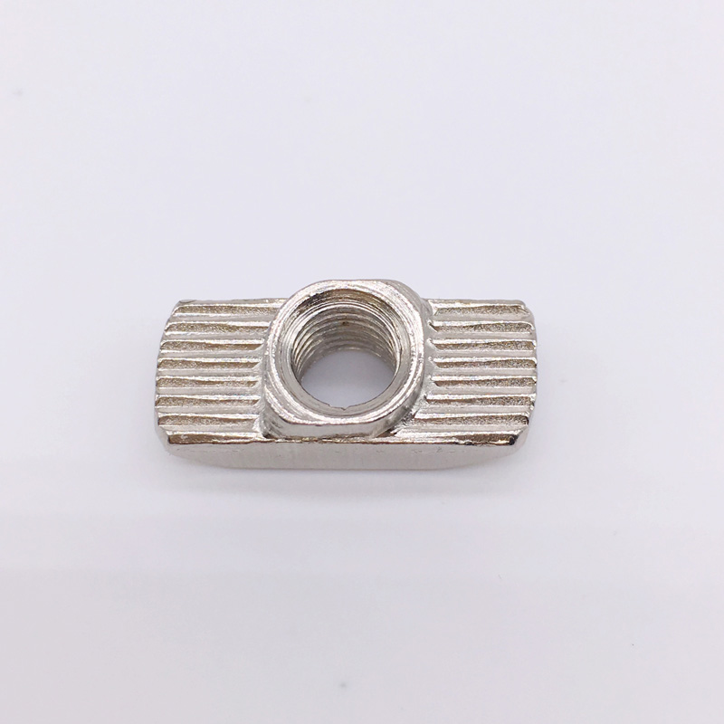
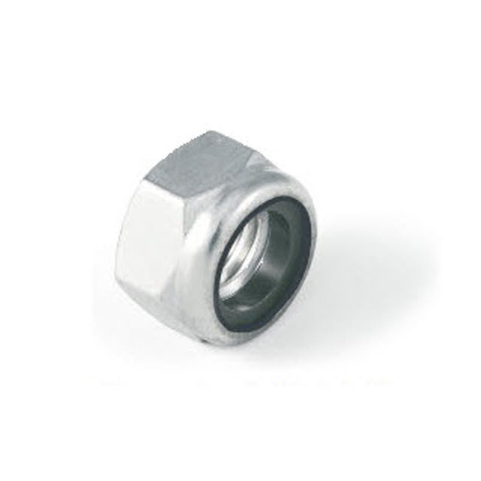
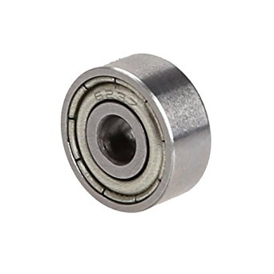
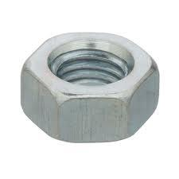
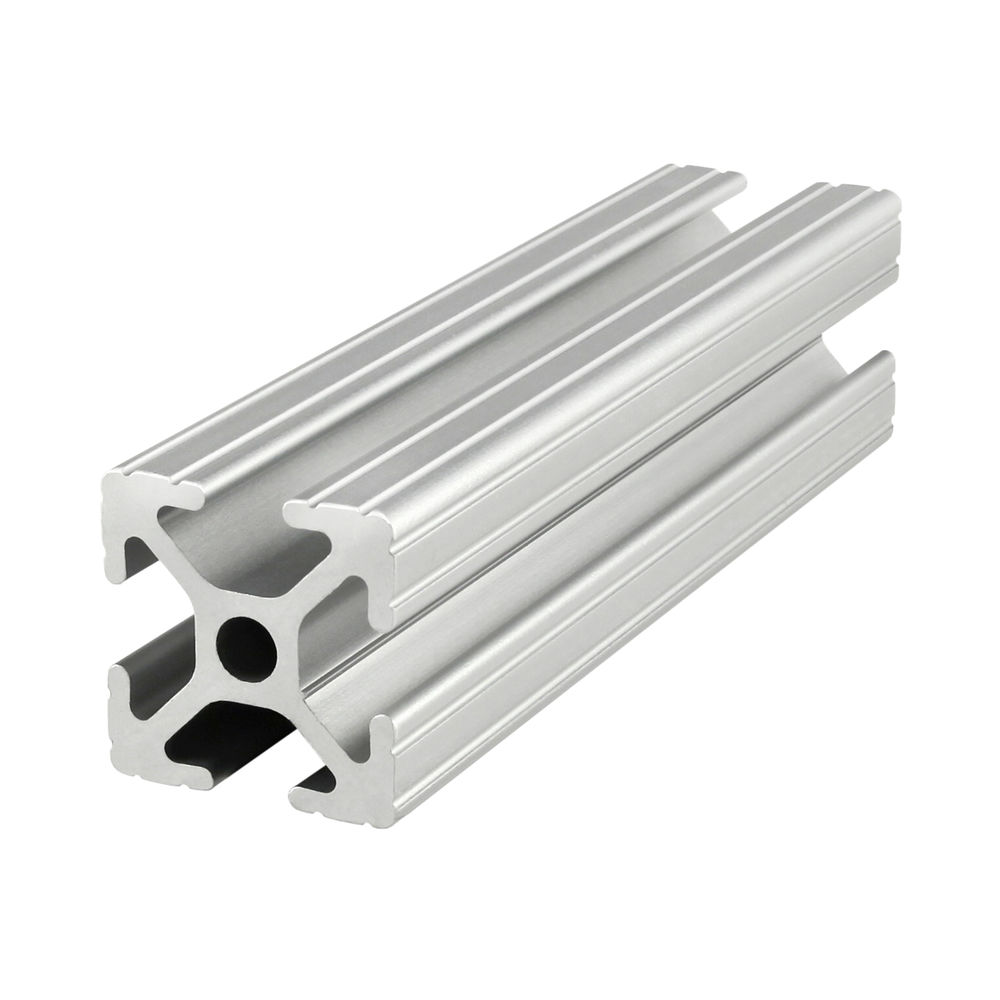

# BOM

| Name | Image |
| :---: | --- |
| M3 screw |  | 
| M3 washer |  | 
| M3 nut |  | 
| M3 T nut |  | 
| M3 self locking nut |  | 
| | | 
| 623ZZ bearing |  | 
| | |
| M6 nut |  | 
| | | 
| Extruded aluminum |  | 
| | | 
| Nema 17 |  | 
| Gt2 pulley (20 teeth 5mm bore)|  | 

