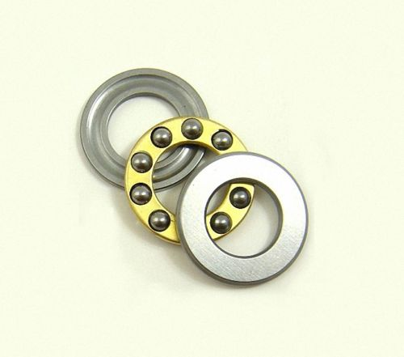

# BOM

| Name | Image |
| :---: | --- |
| M3 screw |  | 
| M3 washer |  | 
| M3 washer large |  | 
| M3 nut |  | 
| M3 T nut |  | 
| M3 butterfly nut |  | 
| M3 self locking nut |  | 
| | | 
| 623ZZ bearing |  | 
| Thrust bearing 8mm |  | 
| | |
| M6 nut |  | 
| | | 
| Extruded aluminum |  | 
| Aluminum bar . 16mm x 16mm x Xmm (1.5mm thickness) |  | 
| | | 
| Nema 17 (17HS4401) |  | 
| Nema 17 with gearbox (17HS15-1684S-PG5) |  | 
| GT2 pulley (20 teeth 5mm bore)|  | 
| GT2 pulley (20 teeth 8mm bore)|  | 
| GT2 Belt |  | 
| GT2 Belt 1524mm |  | 
| | |
| Threaded rod (THSL-600-8D) + Lead Nut 8mm |  |
| | |
| Switch (SS-5GL) |  | 
| | |
| Male power socket IEC320  |  | 

