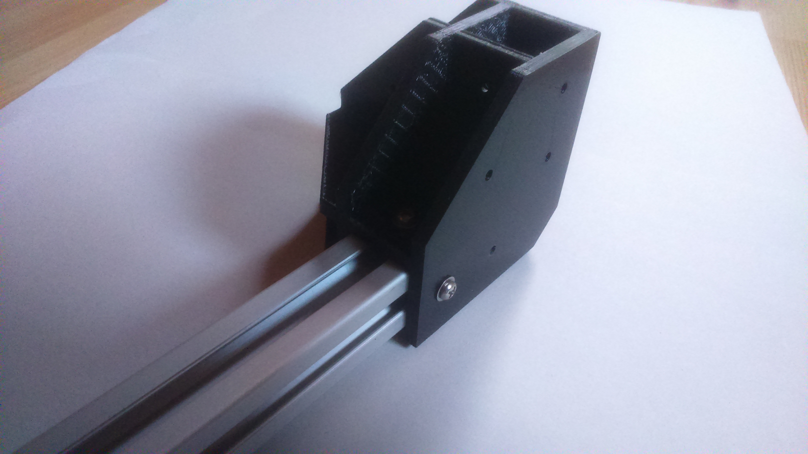
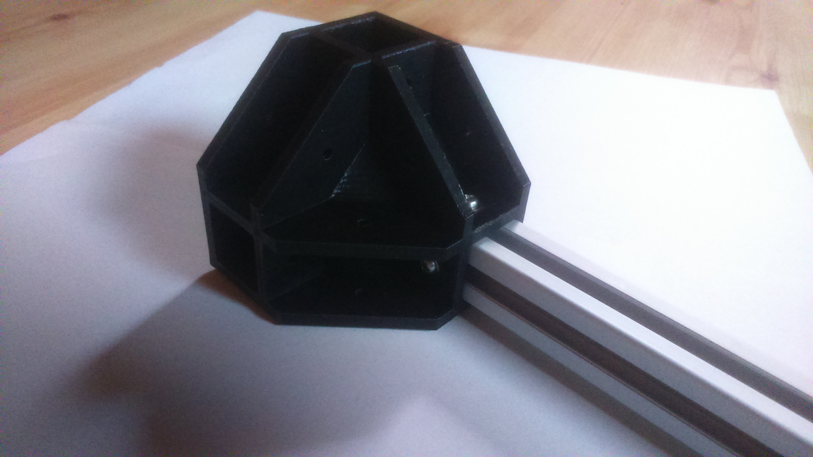
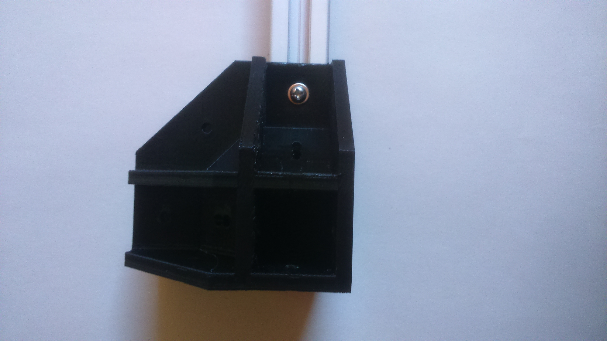
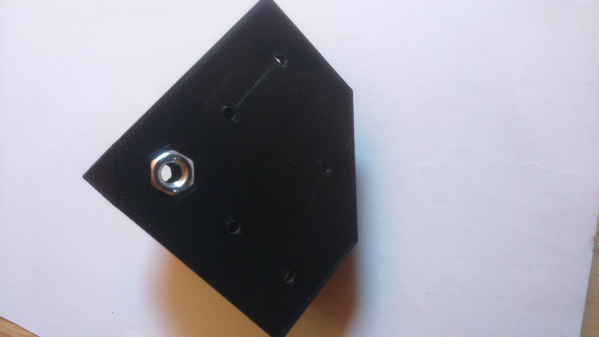
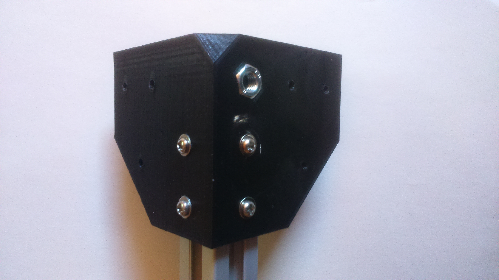
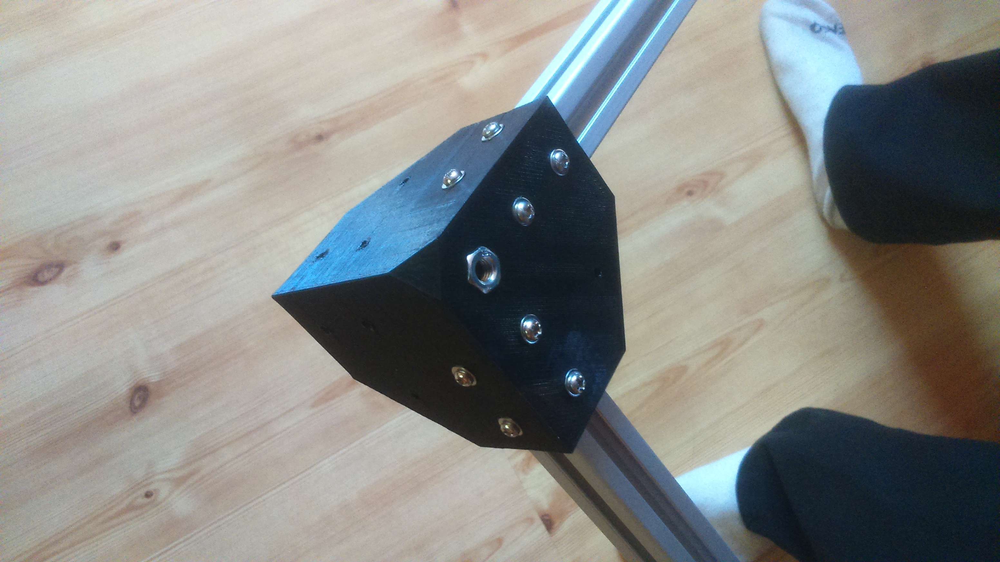
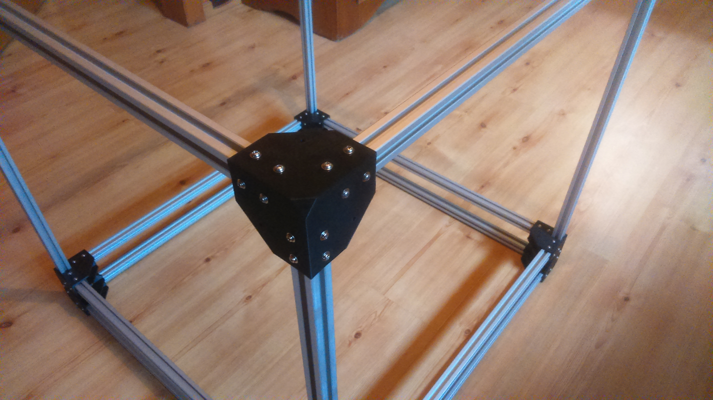
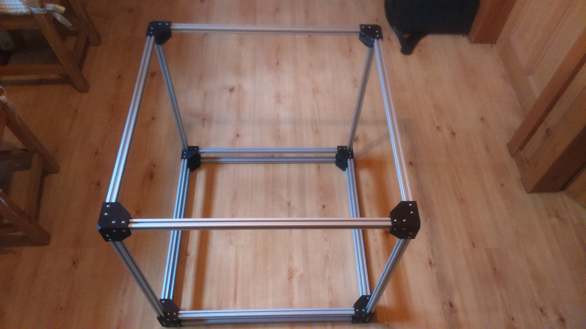
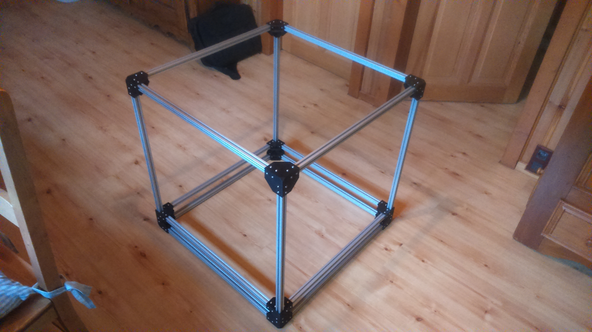

# Frame

## BOM
| Quantity | Name |
| :---: | --- |
| 4 | [Top corner](#top-corners-x-4) | 
| 4 | [Bottom corner](#bottom-corners-x-4) | 
| 4 | [Horizontal corner](#horizontal-corners-x-4) |
| 12 | [Extruded aluminum](../bom/bom.md) 20mm x 20mm x 650mm |

### Top corners x 4
#### BOM
| Quantity | Name |
| :---: | --- |
| 18 | [M3 screw](../bom/bom.md) 8~10mm | 
| 18 | [M3 washer](../bom/bom.md) | 
| 18 | [M3 T nut](../bom/bom.md) | 

#### Print details
* File: [corner_3d_top.stl](../../models/frame/corner_3d_top.stl)
* Time: 6h
* Layer height: 0.2mm
* Weight: 72g
* Support: Yes
* Infill: 50%
 
### Bottom corners x 4
#### BOM
| Quantity | Name |
| :---: | --- |
| 18 | [M3 screw](../bom/bom.md) 8~10mm | 
| 18 | [M3 washer](../bom/bom.md) | 
| 18 | [M3 T nut](../bom/bom.md) | 
| 1 | [M6 nut](../bom/bom.md) | 

#### Print details
* File: [corner_3d_bot.stl](../../models/frame/corner_3d_bot.stl)
* Time: 6h
* Layer height: 0.2mm
* Weight: 72g
* Support: Yes
* Infill: 50%

### Horizontal corners x 4
#### BOM
| Quantity | Name |
| :---: | --- |
| 16 | [M3 screw](../bom/bom.md) 8~10mm | 
| 16 | [M3 washer](../bom/bom.md) | 
| 16 | [M3 T nut](../bom/bom.md) | 

#### Print details
* File: [corner_2d.stl](../../models/frame/corner_2d.stl)
* Time: 3h
* Layer height: 0.2mm
* Weight: 48g
* Support: Yes
* Infill: 50%

## Build steps
When you'll cut the extruded aluminum bar, take care to be really precise else you could have some problems while building the frame.

