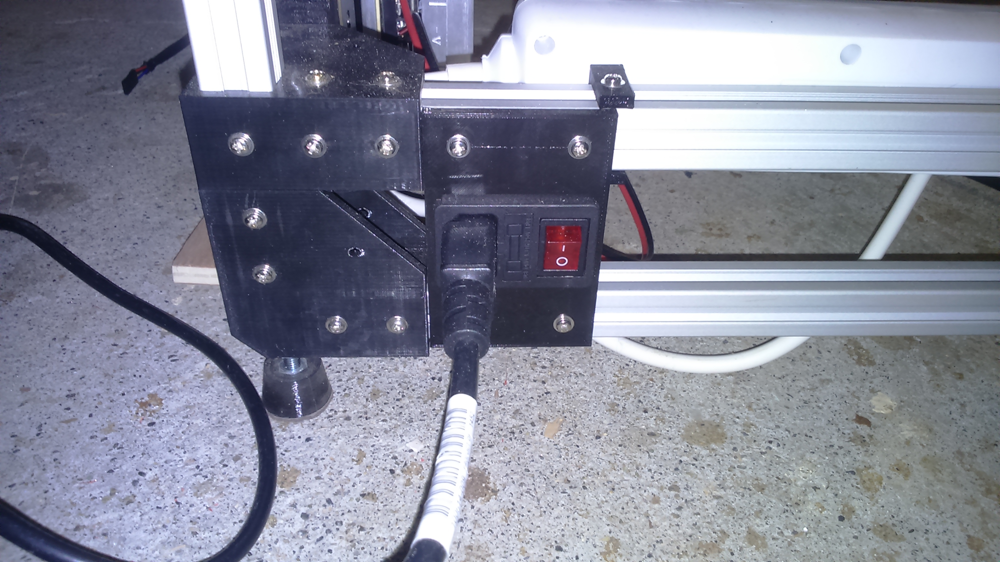
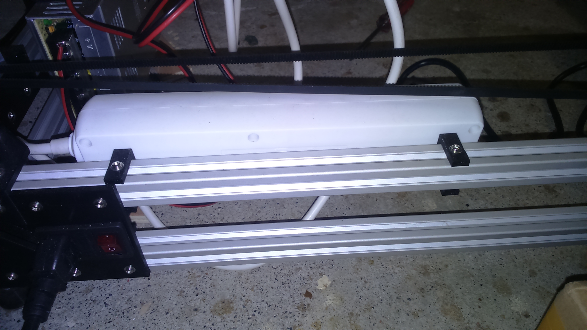
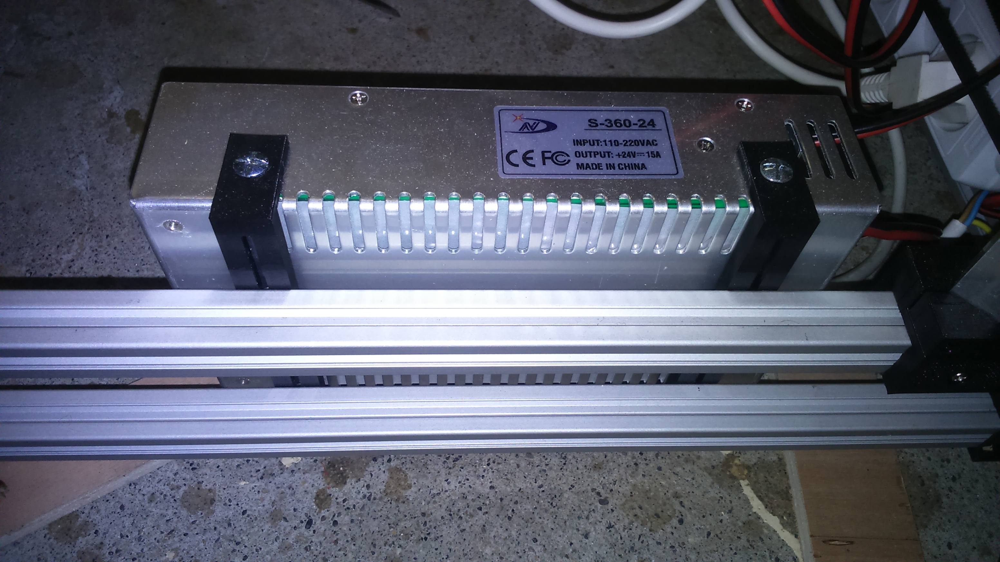

# Power supply

## BOM
| Quantity | Name |
| :---: | --- |
| 1 | [Power socket](#power-socket) |
| 1 | [Power strip](#power-strip) |
| 1 | [Power supply](#power-supply) |

### Power socket
#### BOM
| Quantity | Name |
| :---: | --- |
| 1 | [Male power socket IEC320](../bom/bom.md) |
| 1 | [Power cord IEC320](../bom/bom.md) |
| - | [Heat Shrink Tubing](../bom/bom.md) ~10cm |
| - | [Wire](../bom/bom.md) ~10cm, 1.5mm^2 |
| 4 | [Crimp Terminal Connector](../bom/bom.md) Female, 6mm width |
| 4 | [M3 screw](../bom/bom.md) 8~10mm |
| 4 | [M3 washer](../bom/bom.md) |
| 4 | [M3 T nut](../bom/bom.md) |

#### Print details
* Files: [power_socket.stl](../../models/electronics/power_supply/power_socket.stl)
* Time: 35min
* Layer height: 0.2mm
* Weight: 13g
* Support: No
* Infill: 50%

#### Build steps
Take care to properly insulate the metal contacts to avoid electrocution !

### Power strip
##### BOM
| Quantity | Name |
| :---: | --- |
| 1 | [Power strip](../bom/bom.md) 5 outlets |
| 2 | [Power strip fix](#) - TODO link |

#### Power strip fix x 2
##### BOM
| Quantity | Name |
| :---: | --- |
| 2 | [M3 screw](../bom/bom.md) 8~10mm |
| 2 | [M3 washer](../bom/bom.md) |
| 1 | [M3 self locking nut](../bom/bom.md) |
| 1 | [M3 T nut](../bom/bom.md) |

##### Print details
* Files: [power_strip_fix.stl](../../models/electronics/power_supply/power_strip_fix.stl)
* Time: 25min
* Layer height: 0.2mm
* Weight: 3g
* Support: No

#### Build steps
Drill two holes into the power strip, then fix the printed part to it with a screw, a washer and a self-locking nut. Finally, fix it to the frame.

### Power supply
##### BOM
| Quantity | Name |
| :---: | --- |
| 1 | [Power supply](../bom/bom.md) 24V 15A |
| 1 | [Male plug](../bom/bom.md) ~20cm |
| - | [Wire](../bom/bom.md) 20~50cm, 1.5mm^2 |
| 2 | [Power supply fix](#) - TODO link |

#### Power supply fix x 2
##### BOM
| Quantity | Name |
| :---: | --- |
| 2 | [M3 screw](../bom/bom.md) 8~10mm |
| 2 | [M3 washer](../bom/bom.md) |
| 2 | [M3 T nut](../bom/bom.md) |
| 2 | [M4 screw](../bom/bom.md) 6~7mm |

##### Print details
* Files: [power_supply_fix.stl](../../models/electronics/power_supply/power_supply_fix.stl)
* Time: 55m
* Layer height: 0.2mm
* Weight: 11g
* Support: No

#### Build steps
Drill two holes into the power strip, then fix the printed part to it with a screw, a washer and a self-locking nut. Finally, fix it to the frame.

