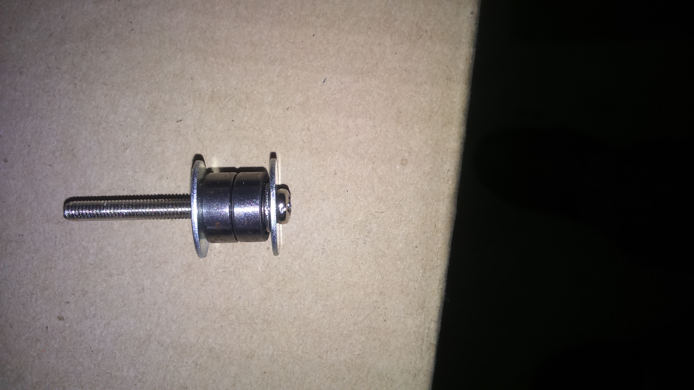
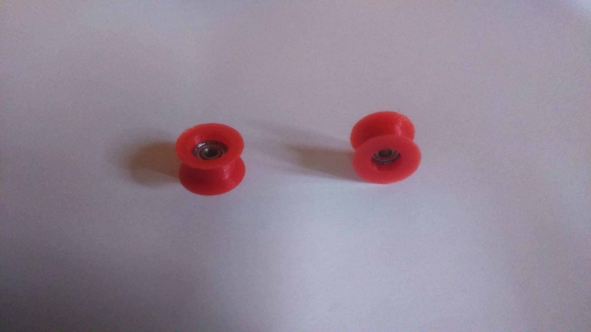

# Pulley

## Type 1
Full metal : stronger and more regular than type 2. I finally chosed this.
### BOM
| Quantity | Name |
| :---: | --- |
| 2 | [M3 washer](../bom/bom.md) | 
| 2 | M3/M4 washer 14mm| 
| 2 | [623ZZ bearing](../bom/bom.md) | 

## Type 2
The problem of this pulley : the print part is not totally perfect (a circle with maybe +-0.05mm) and result in little imperfections.
The advantage : TODO - translate - la couroie ne peux pas frotter

### BOM
| Quantity | Name |
| :---: | --- |
| 2 | [M3 washer](../bom/bom.md) | 
| 2 | [M3 nut](../bom/bom.md) | 
| 1 | [623ZZ bearing](../bom/bom.md) | 

#### Print details
* File: [cariage_bot.stl](../models/XYZ/motors_cariages/belt_pulleyt.stl)
* Time: 5m
* Layer height: 0.2mm
* Weight: 1g
* Support: No

