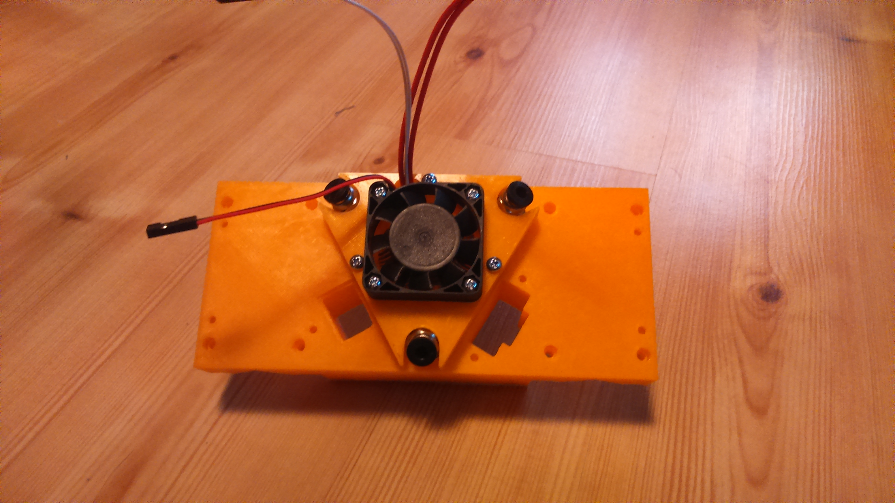

# Extruder: Diamond head (3 pipes)

## BOM
| Quantity | Name |
| :---: | --- |
| 2 | [Tool Fix](#tool-fix) | 
| 1 | [Diamond HotEnd Holder](#diamond-hotend-holder) | 
| 1 | [BL Touch - optional](#bl-touch) | 
| 1 | [Radial Fan - optional](#radial-fan) | 

### Tool Fix x 2
[Same part as milling](../../milling/milling.md)

### Diamond HotEnd Holder
#### BOM
| Quantity | Name |
| :---: | --- |
| 1 | [Diamond HotEnd 3 pipes](../../../bom/bom.md) | 
| 1 | [Fan 40mm](../../../bom/bom.md) | 
| 3 | [M3 screw](../../../bom/bom.md) 14~16mm | 
| 4 | [M3 screw](../../../bom/bom.md) 12~13mm | 
| 7 | [M3 nut](../../../bom/bom.md) | 

#### Print details
* Files: [diamond_hotend_base.stl](../../../../models/tools/hotend/diamond_hotend_base.stl), [diamond_hotend_top_cover.stl](../../../../models/tools/hotend/diamond_hotend_top_cover.stl)
* Time: 6h + 1h10
* Layer height: 0.2mm
* Weight: 72g + 13g
* Support: Yes
* Infill: 25%

#### Build steps

### BL Touch
#### BOM
| Quantity | Name |
| :---: | --- |
| 1 | [BL Touch](../../../bom/bom.md) | 
| 4 | [M3 screw](../../../bom/bom.md) 6mm | 
| 1 | [M3 screw](../../../bom/bom.md) 30mm | 
| 5 | [M3 nut](../../../bom/bom.md) | 
| 2 | [M3 self locking nut](../../../bom/bom.md) | 

#### Print details
* Files: [diamond_hot_end_bltouch_holder.stl](../../../../models/tools/hotend/diamond_hot_end_bltouch_holder.stl), [diamond_hot_end_bltouch_fix_top.stl](../../../../models/tools/hotend/diamond_hot_end_bltouch_fix_top.stl)
* Time: 10m + 7m
* Layer height: 0.2mm
* Weight: 1.5g + 1.3g
* Support: No

#### Build steps

### Radial Fan 
#### BOM
| Quantity | Name |
| :---: | --- |
| 1 | [Radial fan 50mm](../../../bom/bom.md) | 
| 1 | [M3 screw](../../../bom/bom.md) 8mm | 
| 2 | [M3 screw](../../../bom/bom.md) 20mm | 
| 2 | [M3 nut](../../../bom/bom.md) | 

#### Print details
* Files: [diamond_hot_end_fan_holder.stl](../../../../models/tools/hotend/diamond_hot_end_fan_holder.stl)
* Time: 8m
* Layer height: 0.2mm
* Weight: 2g
* Support: No

#### Build steps

