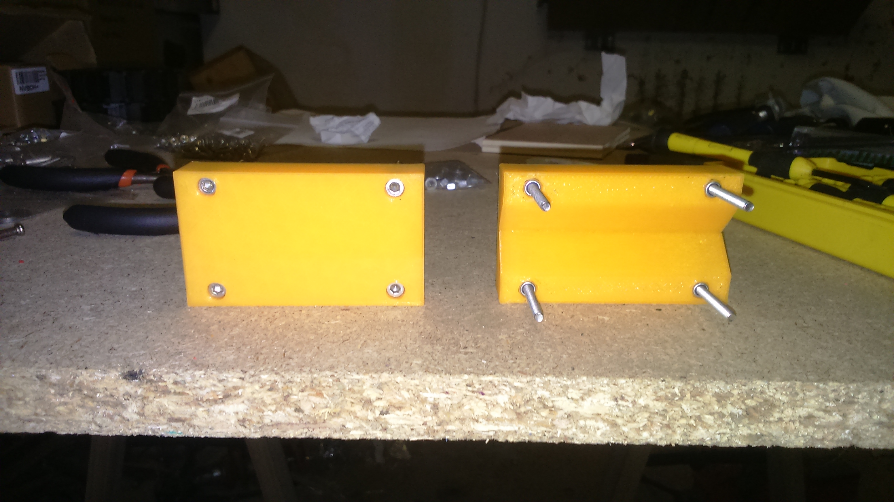
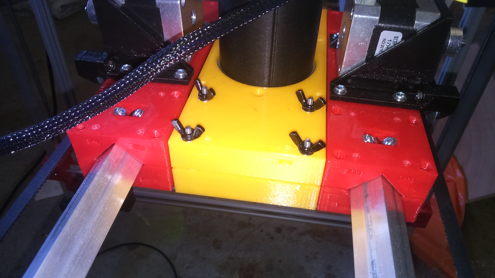
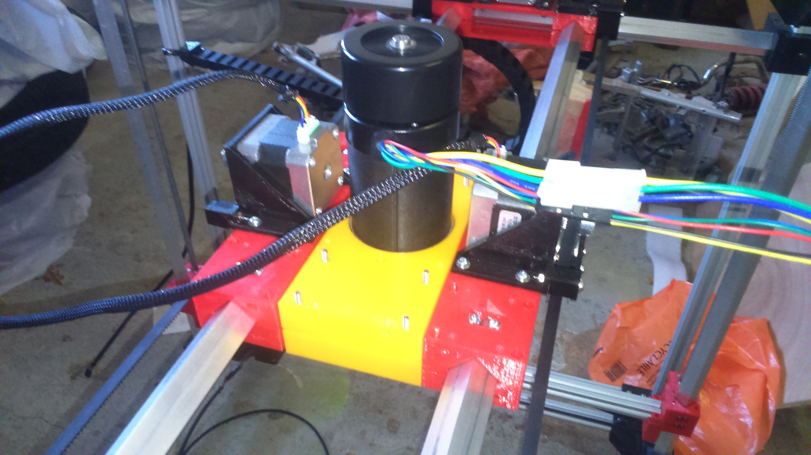
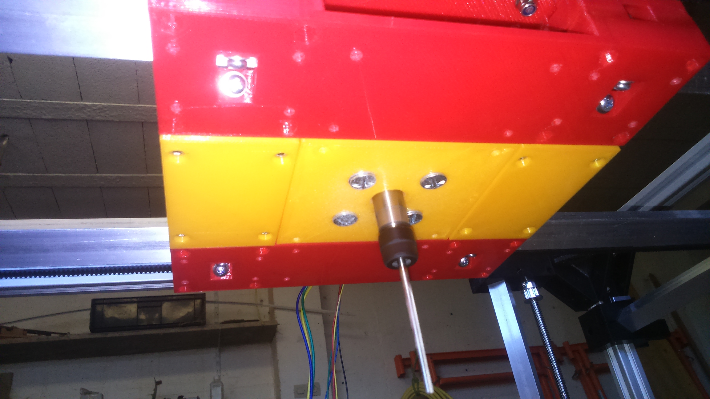

# Spindler

## BOM
| Quantity | Name |
| :---: | --- |
| 2 | [Tool Fix](#) - TODO link | 
| 1 | [Spindler Holder](#) - TODO link | 

### Tool Fix
#### BOM
| Quantity | Name |
| :---: | --- |
| 8 | [M3 screw](../bom/bom.md) 35mm | 
| 8 | [M3 self locking nut](../bom/bom.md) | 
| 8 | [M3 washer](../bom/bom.md) | 
| 8 | [M3 butterfly nut](../bom/bom.md) | 

#### Print details
* Files: [tool_base_bot.stl](../../models/tools/tool_base_bot.stl)
* Time: 1h20
* Layer height: 0.2mm
* Weight: 25g
* Support: No
* Infill: 25%

#### Build steps

**[INFO]** Springs ([Spring 4.8mm](../bom/bom.md)) can be put between the plastic part and the butterfly nuts.

### Spindler Holder
#### BOM
| Quantity | Name |
| :---: | --- |
| 4 | [M4 screw](../bom/bom.md) 20mm | 
| 4 | [M4 washer](../bom/bom.md) | 

#### Print details
* Files: [spindler_laser_diode.stl](../../models/tools/spindler/spindler_laser_diode.stl)
* Time: 6h30
* Layer height: 0.2mm
* Weight: 100g
* Support: Yes
* Infill: 25%

#### Build steps

