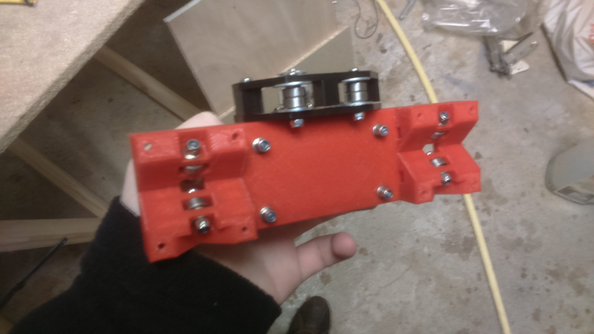
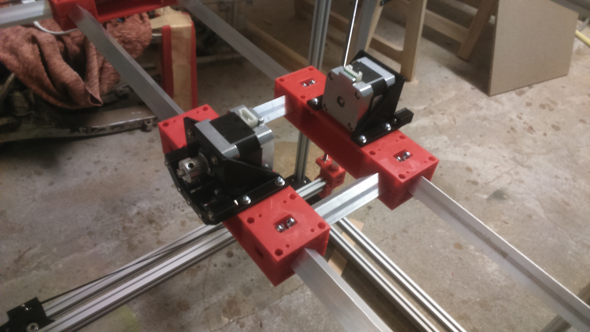
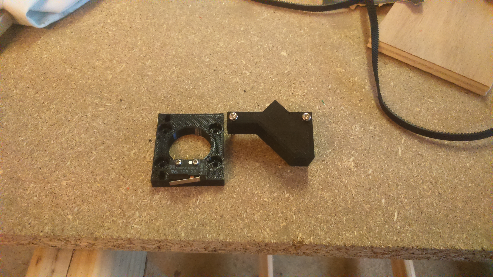
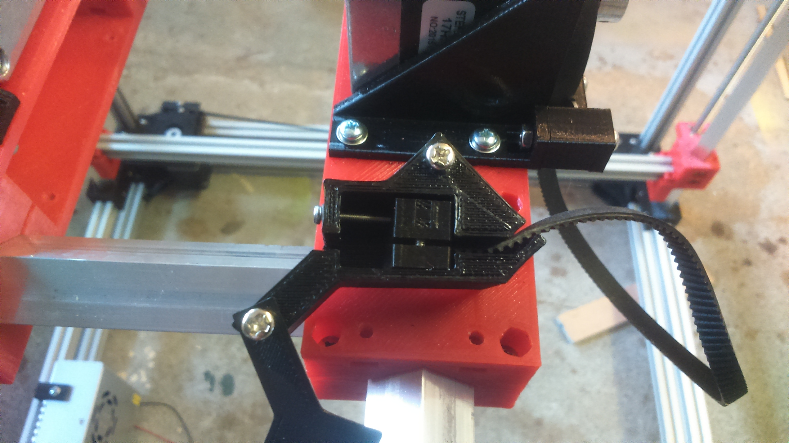
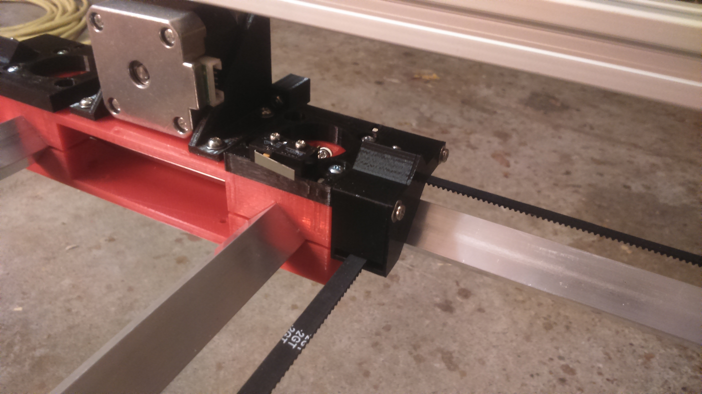
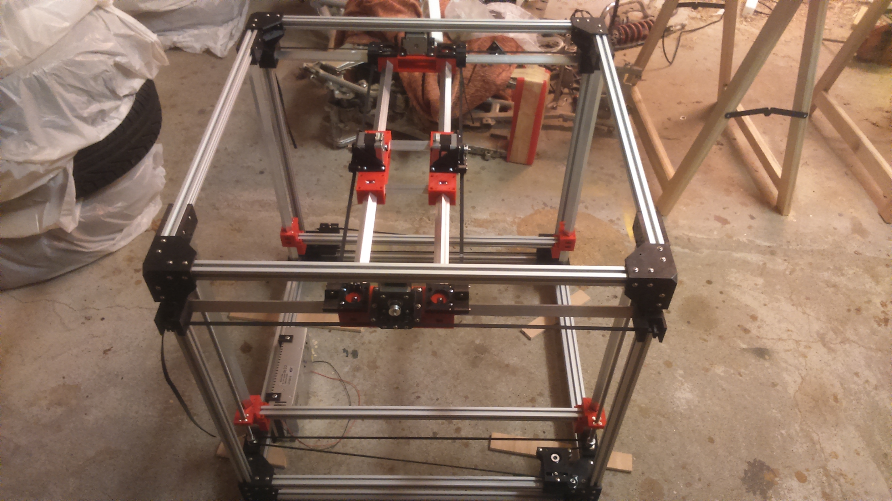
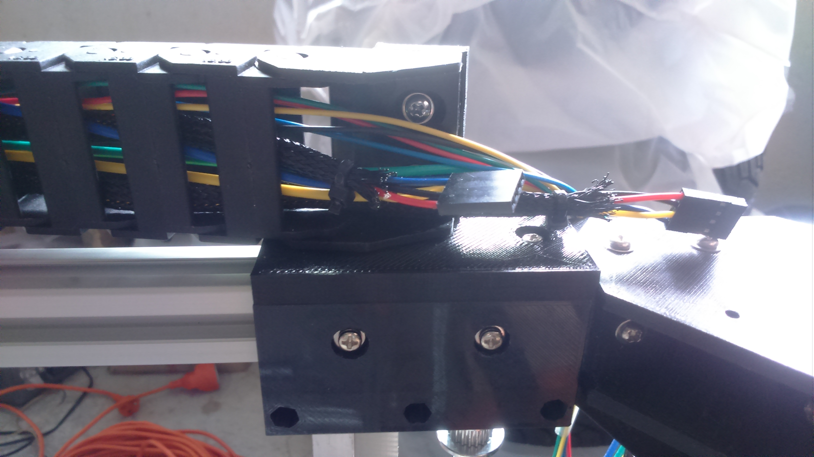
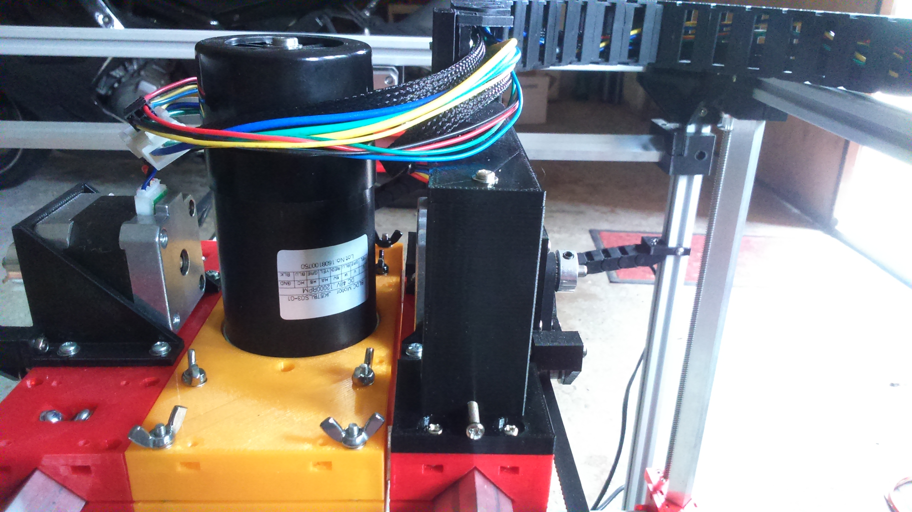
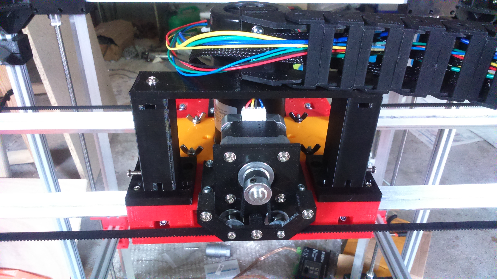
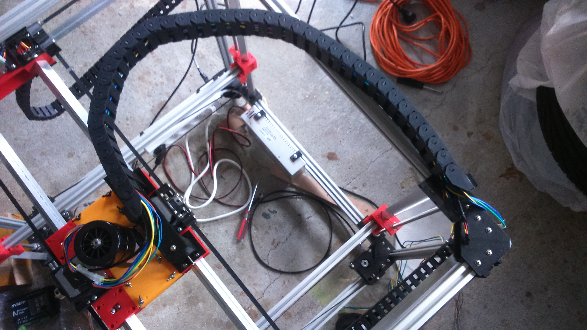

# X Axis

-TODO link table of contents

## BOM
| Quantity | Name |
| :---: | --- |
| 2 | [X carriage](#) |
| 2 | [Motor holder](#) |
| 4 | [Belt tensioner](#) (2 mirrored) |
| 2 | [GT2 Belt](../bom/bom.md) ~80cm |
| 2 | [Aluminum bar](../bom/bom.md) 16mm x 16mm x Xmm (1.5mm thickness) |
| 2 | [Cable chain](#cable-chain) |

### X carriage x 2
#### BOM
##### Bearings
| Quantity | Name |
| :---: | --- |
| 8 | [M3 screw](../bom/bom.md) 16mm |
| 32 | [M3 washer](../bom/bom.md) |
| 8 | [M3 self locking nut](../bom/bom.md) |
| 8 | [623ZZ bearing](../bom/bom.md) |

##### Fixing
| Quantity | Name |
| :---: | --- |
| 8 | [M3 screw](../bom/bom.md) 16mm |
| 8 | [M3 nut](../bom/bom.md) |

#### Print details
* Files: [carriage_bot_x.stl](../../models/XYZ/motors_carriages/carriage/carriage_bot_x.stl), [carriage_top_x.stl](../../models/XYZ/motors_carriages/carriage/carriage_top_x.stl)
* Time: 4h x 2
* Layer height: 0.2mm
* Weight: 50g x 2
* Support: No
* Infill: 50%

#### Build steps

### Motor holder x 2
#### BOM
##### Motor
| Quantity | Name |
| :---: | --- |
| 1 | [Nema 17 motor](../bom/bom.md) |
| 1 | [GT2 pulley](../bom/bom.md) 20 teeth 5mm bore |
| 4 | [M3 screw](../bom/bom.md) 8mm |
| 5 | [M3 screw](../bom/bom.md) 20mm |
| 5 | [M3 nut](../bom/bom.md) |
| 9 | [M3 washer](../bom/bom.md) |
| 2 | [Pulley](../pulley/pulley.md) |

##### Fixing
| Quantity | Name |
| :---: | --- |
| 4 | [M3 screw](../bom/bom.md) 12mm |
| 8 | [M3 washer](../bom/bom.md) |
| 4 | [M3 self locking nut](../bom/bom.md) |

#### Print details
* Files: [motor_block.stl](../../models/XYZ/motors_carriages/motor_block/motor_block.stl), [motor_block_pulley_holder.stl](../../models/XYZ/motors_carriages/motor_block/motor_block_pulley_holder.stl)
* Time: 1h20
* Layer height: 0.2mm
* Weight: 16g
* Support: No

#### Build steps

### Belt tensioner x 4 (2 mirrored)
#### Belt grip
##### BOM
| Quantity | Name |
| :---: | --- |
| 2 | [M2 screw](../bom/bom.md) 6~8mm |
| 1 | [M2 screw](../bom/bom.md) 20~25mm |
| 1 | [M2 washer](../bom/bom.md) |
| 3 | [M2 nut](../bom/bom.md) |

##### Print details
* Files: [belt_tensioner_bot.stl](../../models/XYZ/motors_carriages/belt_tensioner/belt_tensioner_bot.stl), [belt_tensioner_top_grip.stl](../../models/XYZ/motors_carriages/belt_tensioner/belt_tensioner_top_grip.stl)
* Time: 10m
* Layer height: 0.2mm
* Weight: 2g
* Support: No

#### Belt grip case
##### BOM
| Quantity | Name |
| :---: | --- |
| 2 | [M3 screw](../bom/bom.md) 30mm |
| 2 | [M3 washer](../bom/bom.md) |
| 2 | [M3 nut](../bom/bom.md) |

##### Print details
* Files: [belt_holder_x_bot.stl](../../models/XYZ/motors_carriages/belt_holder/belt_holder_x_bot.stl), [belt_holder_x_top.stl](../../models/XYZ/motors_carriages/belt_holder/belt_holder_x_top.stl)
* Time: 40m + 5m
* Layer height: 0.2mm
* Weight: 9g + 1.5g
* Support: No
* Infill: 50%

#### Belt grip fix
##### BOM
| Quantity | Name |
| :---: | --- |
| 4 | [M3 screw](../bom/bom.md) 10mm |
| 4 | [M3 washer](../bom/bom.md) |
| 4 | [M3 nut](../bom/bom.md) |

##### Print details
* File: [belt_holder_x_fix.stl](../../models/XYZ/motors_carriages/belt_holder/belt_holder_x_fix.stl)
* Time: 35m
* Layer height: 0.2mm
* Weight: 7.5g
* Support: No

#### Build steps
Take care to have exactly the same length (number of teeth) for both of the belts.

## Final

### Cable chain
#### Fix to frame
##### BOM
| Quantity | Name |
| :---: | --- |
| 2 | [M3 screw](../bom/bom.md) 12mm | 
| 2 | [M3 screw](../bom/bom.md) 10mm |
| 4 | [M3 washer](../bom/bom.md) |
| 2 | [M3 nut](../bom/bom.md) |
| 2 | [M3 T nut](../bom/bom.md) |
| 1 | [Cable chain 15x30 (~80cm)](../bom/bom.md) |

##### Print details
* File: [cable_chain_15x30_holder_frame_v2.stl](../../models/XYZ/cable_chain/cable_chain_15x30_holder_frame_v2.stl)
* Time: 1h
* Layer height: 0.2mm
* Weight: 15g
* Support: No

#### Fix to carriage
##### BOM
| Quantity | Name |
| :---: | --- |
| 2 | [M3 screw](../bom/bom.md) 12mm | 
| 10 | [M3 screw](../bom/bom.md) 10mm |
| 3 | [M3 screw](../bom/bom.md) 30mm | 
| 12 | [M3 washer](../bom/bom.md) |
| 12 | [M3 nut](../bom/bom.md) |

##### Print details
###### Attaches x 2
* File: [cable_chain_15x30_holder_carriage_attach.stl](../../models/XYZ/cable_chain/cable_chain_15x30_holder_carriage_attach.stl)
* Time: 1h25
* Layer height: 0.2mm
* Weight: 18g
* Support: No
* Infill: 10%

###### Bridge
* File: [cable_chain_15x30_holder_carriage_bridge.stl](../../models/XYZ/cable_chain/cable_chain_15x30_holder_carriage_bridge.stl)
* Time: 1h20
* Layer height: 0.2mm
* Weight: 22g
* Support: No

#### Build steps
The cable chain are generally sold by 1m. Disassemble it with a length around 80cm.
Models may evolves or be different than [mine](http://www.ebay.fr/itm/15-x-30mm-1M-Plastic-Drag-Chain-40-Towline-Carrier-Wire-Cable-CNC-Machine-Tool-/322440353260?hash=item4b12f155ec:g:OpEAAOSw4A5YuOVZ) (if link no more valid, reference to the image in the bom).
If you don't find the exact same model, you'll probably need to edit the scad files.

