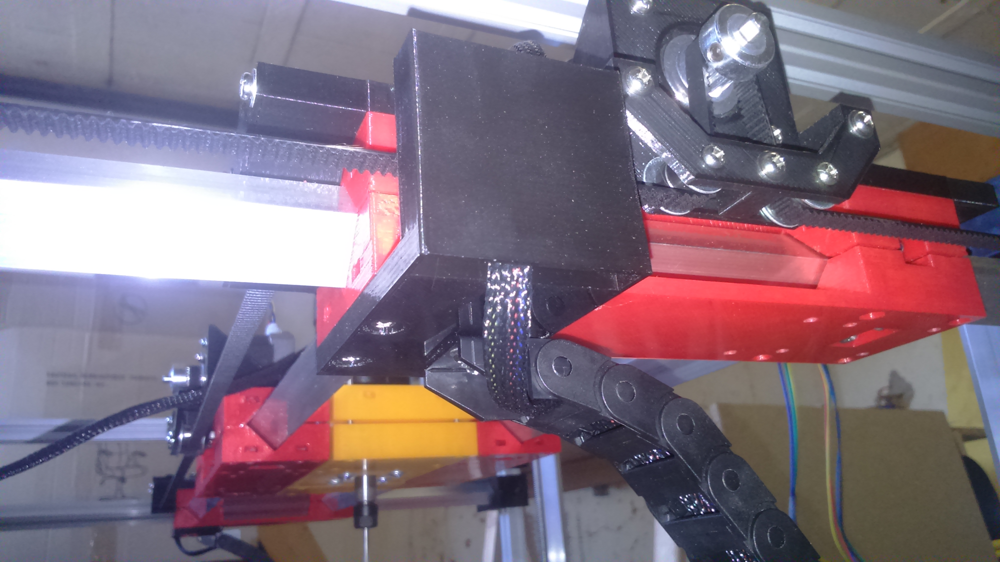

# Y Axis

## BOM
| Quantity | Name |
| :---: | --- |
| 2 | [Y carriage](#y-carriage-x-2) | 
| 2 | [Motor holder](#motor-holder-x-2) | 
| 4 | [Y frame fix](#frame-fix-x-4-2-mirrored) (2 mirrored) |
| 4 | [Belt tensioner](#belt-tensioner-x-4) |
| 2 | [GT2 Belt](../bom/bom.md) ~80cm |
| 4 | [Aluminum bar](../bom/bom.md) 16mm x 16mm x 649mm (1.5mm thickness) |
| 2 | [Cable chain](#cable-chain-x-2) |

### Y carriage x 2
#### BOM
##### Bearings
| Quantity | Name |
| :---: | --- |
| 8 | [M3 screw](../bom/bom.md) 16mm | 
| 32 | [M3 washer](../bom/bom.md) | 
| 8 | [M3 self locking nut](../bom/bom.md) | 
| 8 | [623ZZ bearing](../bom/bom.md) | 

##### Fixing
| Quantity | Name |
| :---: | --- |
| 8 | [M3 screw](../bom/bom.md) 16mm | 
| 8 | [M3 nut](../bom/bom.md) | 

#### Print details
* Files: [carriage_bot_y.stl](../../models/XYZ/motors_carriages/carriage/carriage_bot_y.stl), [carriage_top_y.stl](../../models/XYZ/motors_carriages/carriage/carriage_top_y.stl)
* Time: 4h x 2
* Layer height: 0.2mm
* Weight: 50g x 2
* Support: No
* Infill: 50%

#### Build steps

### Motor holder x 2
#### BOM
##### Motor
| Quantity | Name |
| :---: | --- |
| 1 | [Nema 17 motor](../bom/bom.md) | 
| 1 | [GT2 pulley](../bom/bom.md) 20 teeth 5mm bore | 
| 4 | [M3 screw](../bom/bom.md) 8mm | 
| 5 | [M3 screw](../bom/bom.md) 20mm |
| 5 | [M3 nut](../bom/bom.md) |
| 9 | [M3 washer](../bom/bom.md) | 
| 2 | [Pulley](../pulley/pulley.md) | 

##### Fixing
| Quantity | Name |
| :---: | --- |
| 4 | [M3 screw](../bom/bom.md) 12mm | 
| 8 | [M3 washer](../bom/bom.md) | 
| 4 | [M3 self locking nut](../bom/bom.md) | 

#### Print details
* Files: [motor_block.stl](../../models/XYZ/motors_carriages/motor_block/motor_block.stl), [motor_block_pulley_holder.stl](../../models/XYZ/motors_carriages/motor_block/motor_block_pulley_holder.stl)
* Time: 1h20
* Layer height: 0.2mm
* Weight: 16g
* Support: No

#### Build steps

### Frame fix x 4 (2 mirrored)
#### BOM
| Quantity | Name |
| :---: | --- |
| 2 | [M3 screw](../bom/bom.md) 8~10mm | 
| 2 | [M3 screw](../bom/bom.md) 16mm |
| 2 | [M3 washer](../bom/bom.md) |
| 2 | [M3 nut](../bom/bom.md) |
| 2 | [M3 T nut](../bom/bom.md) |

#### Print details
* Files: [motor_block.stl](../../models/XYZ/motors_carriages/rod_fix/rod_fix_bot.stl), [motor_block_pulley_holder.stl](../../models/XYZ/motors_carriages/rod_fix/rod_fix_top.stl)
* Time: 1h30m + 30m
* Layer height: 0.2mm
* Weight: 26g
* Support: No

#### Build steps

### Belt tensioner x 4
#### BOM
| Quantity | Name |
| :---: | --- |
| 2 | [M2 screw](../bom/bom.md) 6~8mm | 
| 1 | [M2 screw](../bom/bom.md) 25~30mm |
| 1 | [M2 washer](../bom/bom.md) |
| 3 | [M2 nut](../bom/bom.md) |

#### Print details
* Files: [belt_tensioner_bot_grip.stl](../../models/XYZ/motors_carriages/belt_tensioner/belt_tensioner_bot_grip.stl), [belt_tensioner_top.stl](../../models/XYZ/motors_carriages/belt_tensioner/belt_tensioner_top.stl)
* Time: 10m
* Layer height: 0.2mm
* Weight: 2g
* Support: No

#### Build steps
Take care to have exactly the same length (number of teeth) for both of the belts.

### Assembled

### Cable chain x 2
#### BOM
| Quantity | Name |
| :---: | --- |
| 2 | [M3 screw](../bom/bom.md) 7~8mm | 
| 8 | [M3 screw](../bom/bom.md) 10mm |
| 10 | [M3 washer](../bom/bom.md) |
| 8 | [M3 nut](../bom/bom.md) |
| 2 | [M3 T nut](../bom/bom.md) |
| 1 | [Cable chain 10x20 (70~80cm)](../bom/bom.md) |

#### Print details
* Files: [cable_chain_10x20_holder_frame.stl](../../models/XYZ/cable_chain/cable_chain_10x20_holder_frame.stl),
[cable_chain_10x20_holder_carriage_1.stl](../../models/XYZ/cable_chain/cable_chain_10x20_holder_carriage_1.stl),
[cable_chain_10x20_holder_carriage_2.stl](../../models/XYZ/cable_chain/cable_chain_10x20_holder_carriage_2.stl)
* Time: 15m + 1h
* Layer height: 0.2mm
* Weight: 3.5g + 15g
* Support: Yes

#### Build steps
The cable chain are generally sold by 1m. Disassemble it with a length around 70cm, and you'll probably need to revert one the the ends.
Models may evolves or be different than [mine](http://www.ebay.fr/itm/252523694750?_trksid=p2057872.m2749.l2649&ssPageName=STRK%3AMEBIDX%3AIT) (if link no more valid, reference to the image in the bom).
If you don't find the exact same model, you'll probably need to edit the scad files.

