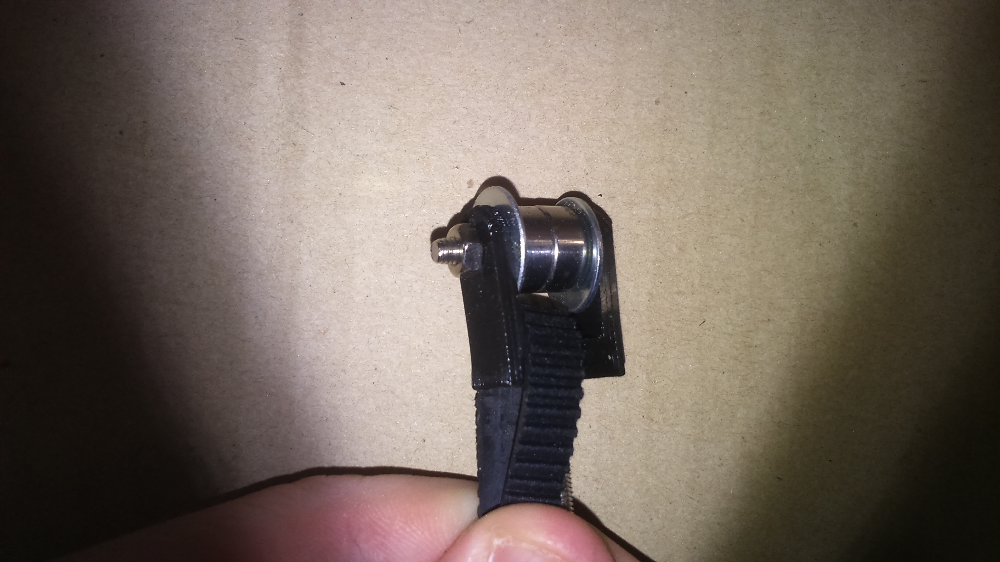

# Z Axis

## BOM
| Quantity | Name |
| :---: | --- |
| 4 | [Z carriage](#) | 
| 2 | [Motor holder](#) | 
| 2 | [Belt tensioner](#) | 
| 4 | [Z frame fix](#) (2 mirrored) |
| 2 | [GT2 Belt](../bom/bom.md) loop 1524mm |
| 4 | [Aluminum bar](../bom/bom.md) 16mm x 16mm x Xmm (1.5mm thickness) |

### Z carriage x 4
#### BOM
##### Bearings
| Quantity | Name |
| :---: | --- |
| 4 | [M3 screw](../bom/bom.md) 16mm | 
| 16 | [M3 washer](../bom/bom.md) | 
| 4 | [M3 self locking nut](../bom/bom.md) | 
| 4 | [623ZZ bearing](../bom/bom.md) | 

##### Lead nut
| Quantity | Name |
| :---: | --- |
| 4 | [M3 screw](../bom/bom.md) 16mm | 
| 4 | [M3 nut](../bom/bom.md) | 
| 1 | [Threaded rod lead nut](../bom/bom.md) | 

##### Fixing
| Quantity | Name |
| :---: | --- |
| 4 | [M3 screw](../bom/bom.md) 16mm | 
| 4 | [M3 nut](../bom/bom.md) | 

#### Print details
* Files: [cariage_z_back.stl](../../models/XYZ/Z/cariage/cariage_z_back.stl), [cariage_z_front.stl](../../models/XYZ/Z/cariage/cariage_z_front.stl)
* Time: 2h x 2
* Layer height: 0.2mm
* Weight: 13g x 2
* Support: No
* Infill: 50%

#### Build steps

### Motor holder x 2
#### BOM
##### Motor
###### High torque (recommended, can lift ~16kg)
| Quantity | Name |
| :---: | --- |
| 1 | [Nema 17 with gearbox](../bom/bom.md) | 
| 1 | [GT2 pulley](../bom/bom.md) 20 teeth 8mm bore | 
| 4 | [M3 screw](../bom/bom.md) 35mm | 
| 4 | [M3 washer](../bom/bom.md) | 

###### Low torque (alternative, can lift ~4kg)
| Quantity | Name |
| :---: | --- |
| 1 | [Nema 17](../bom/bom.md) | 
| 1 | [GT2 pulley](../bom/bom.md) 20 teeth 5mm bore | 
| 4 | [M3 screw](../bom/bom.md) 8mm | 
| 4 | [M3 washer](../bom/bom.md) | 

##### Fixing
| Quantity | Name |
| :---: | --- |
| 4 | [M3 screw](../bom/bom.md) 8~10mm | 
| 4 | [M3 washer](../bom/bom.md) | 
| 4 | [M3 self locking nut](../bom/bom.md) | 

#### Print details
##### Motor block
* File: [motor_block.stl](../../models/XYZ/Z/motor_block/motor_block.stl)
* Time: 1h50
* Layer height: 0.2mm
* Weight: 22g
* Support: No

##### Gearbox adatper (high torque)
* File: [motor_gearbox_adapter.stl](../../models/XYZ/Z/motor_block/motor_gearbox_adapter.stl)
* Time: 40m
* Layer height: 0.2mm
* Weight: 4g
* Support: No

#### Build steps

TODO : add photo of nema 17 + gearbox

### Belt tensioner x 2
#### BOM
| Quantity | Name |
| :---: | --- |
| 3 | [Pulley](../pulley/pulley.md) |
| 4 | [M3 screw](../bom/bom.md) 30mm | 
| 1 | [M3 screw](../bom/bom.md) 20mm | 
| 6 | [M3 washer](../bom/bom.md) | 
| 7 | [M3 nut](../bom/bom.md) | 
| 1 | [M3 self locking nut](../bom/bom.md) | 
| 1 | [M3 butterfly nut](../bom/bom.md) | 

#### Print details
* File: [motor_block_pulley_holder_bot.stl](../../models/XYZ/Z/motor_block/motor_block_pulley_holder_bot.stl), [motor_block_pulley_holder_top.stl](../../models/XYZ/Z/motor_block/motor_block_pulley_holder_top.stl), [pulley_holder.stl](../../models/XYZ/Z/motor_block/pulley_holder.stl)
* Time: 40min + 40min + 5min
* Layer height: 0.2mm
* Weight: 7g + 7g + 1g
* Support: No

#### Build steps

Take time to adjust the space beetween this part and the motor bloc. Maybe you'll need to add more washes.

// continue here

### Frame fix x 4 (2 mirrored)
#### BOM
| Quantity | Name |
| :---: | --- |
| 2 | [M3 screw](../bom/bom.md) 8~10mm | 
| 2 | [M3 screw](../bom/bom.md) 16mm |
| 2 | [M3 washer](../bom/bom.md) |
| 2 | [M3 nut](../bom/bom.md) |
| 2 | [M3 T nut](../bom/bom.md) |

#### Print details
* Files: [motor_block.stl](../../models/XYZ/motors_cariages/rod_fix/rod_fix_bot.stl), [motor_block_pulley_holder.stl](../../models/XYZ/motors_cariages/rod_fix/rod_fix_top.stl)
* Time: 1h30m + 30m
* Layer height: 0.2mm
* Weight: 26g
* Support: No

#### Build steps

## Final

