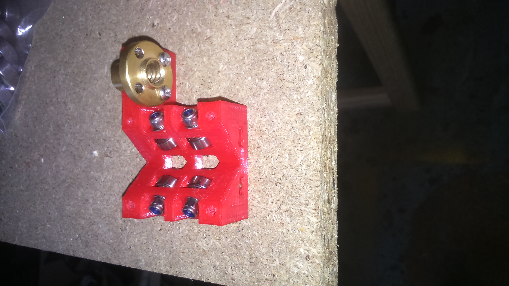
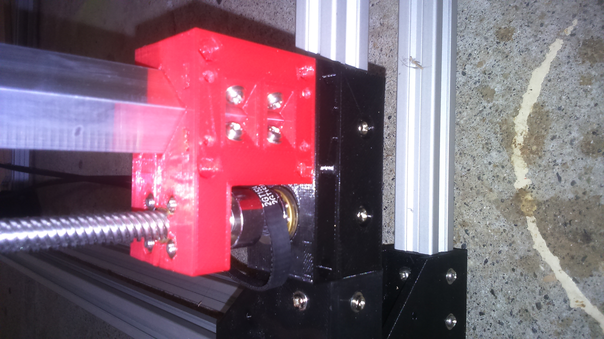

# Z Axis

## BOM
| Quantity | Name |
| :---: | --- |
| 4 | [Z carriage](#) | 
| 2 | [Motor holder](#) | 
| 4 | [Z frame fix](#) (2 mirrored) |
| 2 | [GT2 Belt](../bom/bom.md) loop 1524mm |
| 4 | [Aluminum bar](../bom/bom.md) 16mm x 16mm x Xmm (1.5mm thickness) |

### Z carriage x 4
#### BOM
##### Bearings
| Quantity | Name |
| :---: | --- |
| 4 | [M3 screw](../bom/bom.md) 16mm | 
| 16 | [M3 washer](../bom/bom.md) | 
| 4 | [M3 self locking nut](../bom/bom.md) | 
| 4 | [623ZZ bearing](../bom/bom.md) | 

##### Lead nut
| Quantity | Name |
| :---: | --- |
| 4 | [M3 screw](../bom/bom.md) 16mm | 
| 4 | [M3 nut](../bom/bom.md) | 
| 1 | [Threaded rod lead nut](../bom/bom.md) | 

##### Fixing
| Quantity | Name |
| :---: | --- |
| 4 | [M3 screw](../bom/bom.md) 16mm | 
| 4 | [M3 nut](../bom/bom.md) | 

#### Print details
* Files: [cariage_z_back.stl](../../models/XYZ/Z/cariage/cariage_z_back.stl), [cariage_z_front.stl](../../models/XYZ/Z/cariage/cariage_z_front.stl)
* Time: 4h x 2
* Layer height: 0.2mm
* Weight: 50g x 2
* Support: No
* Infill: 50%

#### Build steps

### Motor holder x 2
#### BOM
##### Motor
| Quantity | Name |
| :---: | --- |
| 1 | [Nema 17 motor](../bom/bom.md) | 
| 1 | [GT2 pulley](../bom/bom.md) 20 teeth 5mm bore | 
| 4 | [M3 screw](../bom/bom.md) 8mm | 
| 5 | [M3 screw](../bom/bom.md) 20mm |
| 5 | [M3 nut](../bom/bom.md) |
| 9 | [M3 washer](../bom/bom.md) | 
| 2 | [Pulley](../pulley/pulley.md) | 

##### Fixing
| Quantity | Name |
| :---: | --- |
| 4 | [M3 screw](../bom/bom.md) 12mm | 
| 8 | [M3 washer](../bom/bom.md) | 
| 4 | [M3 self locking nut](../bom/bom.md) | 

#### Print details
* Files: [motor_block.stl](../../models/XYZ/motors_cariages/motor_block/motor_block.stl), [motor_block_pulley_holder.stl](../../models/XYZ/motors_cariages/motor_block/motor_block_pulley_holder.stl)
* Time: -
* Layer height: 0.2mm
* Weight: -
* Support: No

#### Build steps

### Frame fix x 4 (2 mirrored)
#### BOM
| Quantity | Name |
| :---: | --- |
| 2 | [M3 screw](../bom/bom.md) 8~10mm | 
| 2 | [M3 screw](../bom/bom.md) 16mm |
| 2 | [M3 washer](../bom/bom.md) |
| 2 | [M3 nut](../bom/bom.md) |
| 2 | [M3 T nut](../bom/bom.md) |

#### Print details
* Files: [motor_block.stl](../../models/XYZ/motors_cariages/rod_fix/rod_fix_bot.stl), [motor_block_pulley_holder.stl](../../models/XYZ/motors_cariages/rod_fix/rod_fix_top.stl)
* Time: 1h30m + 30m
* Layer height: 0.2mm
* Weight: 26g
* Support: No

#### Build steps

### Belt tensionner x 4
#### BOM
| Quantity | Name |
| :---: | --- |
| 2 | [M2 screw](../bom/bom.md) 6~8mm | 
| 1 | [M2 screw](../bom/bom.md) 25~30mm |
| 1 | [M2 washer](../bom/bom.md) |
| 3 | [M2 nut](../bom/bom.md) |

#### Print details
* Files: [belt_holder_bot.stl](../../models/XYZ/motors_cariages/belt_holder/belt_holder_bot.stl), [belt_holder_top.stl](../../models/XYZ/motors_cariages/belt_holder/belt_holder_top.stl)
* Time: 10m
* Layer height: 0.2mm
* Weight: 2g
* Support: No

#### Build steps
Take care to have exactly the same length (number of teeth) for both of the belts.

## Final

